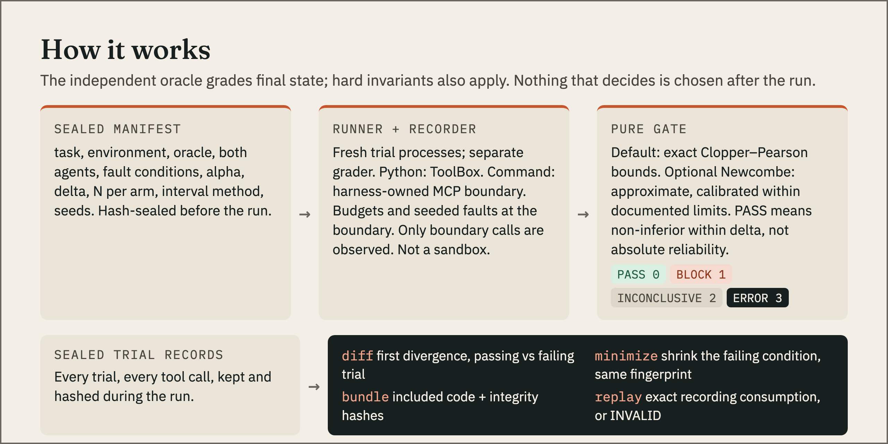

# agent-reliability-ci


**Regression testing for stochastic AI agents.** `arci` turns "it passed when I tried it" into a
frozen, repeated experiment with an honest verdict, and turns a measured regression into a small
failure case you can replay offline.

```text
Normal CI            Agent A: PASS      Agent B: PASS          ship it
arci (N=200 each)    Agent A: 192/200   Agent B: 132/200       VERDICT: BLOCK (exit 1)
                     first divergence: right after the injected tool_timeout on `reserve`
                     1-minimal reproducer: 3 injected faults -> 1, replays offline: REPRODUCED
                     repaired Agent C: passes the reproducer, 192/200, VERDICT: PASS (exit 0)
```

Status: v0.3.0. Python agents that use the declared tool boundary, and any program that speaks MCP
over stdio. Read
[what it does not do](#limits) before you rely on it.

## Why

One run of an agent tells you almost nothing. Repeated runs with CI thresholds are available in
other tools (as of September 2026: Promptfoo, LangSmith, Braintrust, Inspect AI, pytest-repeat;
check their current docs). What is usually missing is the step
after the number moves: *which* run to look at, *where* it went wrong, and a reproducer small enough
to fix against. That step is what `arci` is for.

## The demo

```bash
uv sync
.venv/bin/python examples/retry_agent/hero_demo.py
```

It runs six steps through the real CLI and the Python API: 1,231 trials, each in a fresh process with
a separate grader process. On the author's 15-core laptop that takes about 30 seconds; a 2-vCPU CI
runner needs several minutes. `uv sync` needs the network once; the trials make no model calls.

1. One illustrative run: agents A and B both pass.
2. The frozen experiment (200 trials per arm, `tool_timeout` injected on the first `reserve` call)
   BLOCKs B and PASSes A against itself.
3. The paired trace diff names the first divergent step, right after the injected fault.
4. The fault minimiser shrinks a 3-fault condition to the one fault that matters, and only then
   calls it 1-minimal.
5. The exported bundle replays the failure offline from its recording.
6. The repaired agent C passes the exact reproducer and its own separately frozen experiment.


Agent B is not rigged with dice. It is agent A with the retry around `reserve` removed, a plausible
refactoring slip: when `reserve` times out it carries on to `confirm` and still reports success. Its
failure rate comes from the environment. Reservations already exist with configured probability
65% (135 of the default 200 seeds, plus 8 scenarios with a naturally flaky `confirm`), and in those
the missing retry never matters. That is exactly why one run hides it.

## Real agents (v0.2)

An agent does not have to be a Python function. A **command agent** is any program that speaks MCP
over stdio: `arci` owns the one MCP server behind it, so every tool call is recorded, budgeted,
fault-injected and replayable, from outside the agent's process.

```text
your agent (any argv) --> arci.mcp_shim --> arci.mcp_boundary --> MCP server (the environment)
                          byte relay        recorder, faults,     yours, or any python toolset via
                                            budgets, latches      python -m arci.mcp_toolset_server
```

[docs/REAL_AGENTS.md](docs/REAL_AGENTS.md) has the recipe and a worked example: a real tool-calling
agent on a local Ollama model whose two arms differ by one sentence of the system prompt.

## How it works



```text
manifest (sealed, frozen before the run)
  task + toolset + independent oracle + contract
  baseline agent, candidate agent
  K fault conditions, alpha, delta, n_per_arm, seeds
        |
        v
runner: per trial, a Python worker OR a command agent + MCP boundary + server; a separate
  grader process; everything killed as process groups at the deadline
  ToolBox = the tool boundary: budgets, seeded fault injection, record / replay
  every event streams to ONE parent writer -> events.jsonl, trials.jsonl (sealed envelopes)
        |
        v
gate: pure function (manifest, trials) -> sealed decision, exit code 0 / 1 / 2 / 3
        |
        +--> diff       first divergence between a passing and a failing trial
        +--> minimize   ddmin over the injected faults, same failure fingerprint required
        +--> bundle     portable reproducer: spec + recording + embedded code + hashes
        +--> replay     REPRODUCED / NOT_REPRODUCED / INVALID
```

A Python agent is a plain function, `agent(task, tools, rng) -> dict`. It calls `tools.call("name", ...)`
and may annotate its reasoning with `tools.note_model_step(...)`. Success is decided by an oracle
over the environment's final state, never by what the agent says about itself.

## The verdict

| Verdict | Exit | Meaning |
|---|---:|---|
| `PASS` | 0 | The candidate is non-inferior to the baseline within `delta`. Nothing about absolute reliability. |
| `BLOCK` | 1 | The candidate is worse by more than `delta`, or it broke a hard invariant. |
| `INCONCLUSIVE` | 2 | Not enough evidence either way. CI stays non-green. No regression is claimed. |
| `ERROR` | 3 | The experiment is invalid: a harness or grader fault, a missing, duplicated or foreign trial, a broken seal. It can never pass. |

The rule is fixed-sample and deliberately boring ([docs/STATISTICS.md](docs/STATISTICS.md)): per arm,
an exact Clopper-Pearson interval at tail `alpha / (4K)`; bounds on the difference by Bonferroni;
`PASS` iff the lower bound is above `-delta`, `BLOCK` iff the upper bound is below it. No peeking, no
extending a run, no rerunning until green. The manifest author lists earlier runs on the same
candidate in `prior_runs` and they are printed in the decision and the Markdown report; v0.1 does
not discover them or enforce a cross-run error budget for you. Wilson intervals are shown for readability and never decide.

An agent crash, timeout, blown budget or uncaught tool fault is a `FAIL`. A broken environment,
injector, grader or event sink is an `ERROR`, and it invalidates the experiment instead of quietly
leaving the denominator.

### Calibration, measured

`bench/selfcheck.py` computes the gate's own operating characteristics by exact enumeration
(`alpha` 0.05, `delta` 0.10, one condition). Probabilities of PASS / BLOCK / INCONCLUSIVE:

| baseline -> candidate | N=20 | N=100 | N=200 | N=400 |
|---|---|---|---|---|
| 0.95 -> 0.95 | .000 / .000 / 1.000 | .443 / .000 / .557 | .889 / .000 / .111 | .999 / .000 / .001 |
| 0.95 -> 0.85 (the margin) | .000 / .000 / 1.000 | .001 / .000 / .999 | .001 / .000 / .999 | .001 / .001 / .999 |
| 0.95 -> 0.75 | .000 / .000 / 1.000 | .000 / .093 / .907 | .000 / .365 / .635 | .000 / .828 / .172 |
| 0.95 -> 0.65 | .000 / .008 / .992 | .000 / .685 / .315 | .000 / .985 / .015 | .000 / 1.000 / .000 |
| 0.80 -> 0.80 | .003 / .000 / .997 | .059 / .000 / .941 | .218 / .000 / .782 | .615 / .000 / .385 |


Read it honestly:

- False PASS at the margin and false BLOCK under no change are both far below `alpha`. The price is
  conservatism: two equal agents at 80% reach PASS only 22% of the time at N=200.
- **Twenty runs decide almost nothing.** At N=20 a 95% -> 65% collapse is still INCONCLUSIVE 99% of
  the time. Zero failures in 20 trials still allows a 13.9% failure rate (one-sided 95%); showing a
  rate below 0.5% needs at least 598 clean trials.
- If that is too slow for you, set `interval_method: newcombe` in the manifest (v0.3). Same alpha,
  about twice the power (two equal 80% agents: PASS 71% instead of 22% at N=200; a 0.94 -> 0.77
  drop at N=400: BLOCK 83% instead of 37%), calibrated by exact enumeration rather than proved. It
  must be frozen before the run like everything else. Sequential stopping is on the
  [roadmap](docs/ROADMAP.md).

## Use it

```bash
arci run manifest.json --out runs --workers 8     # run + gate; exit code is the verdict
arci gate runs/<experiment> --junit junit.xml --markdown report.md
arci diff runs/<experiment> <passing_trial> <failing_trial>    # --all-steps to include annotations
arci minimize runs/<experiment> <failing_trial> --out min.json
arci bundle runs/<experiment> <failing_trial> --out bundle.json --root . --include my_agent.py
arci replay bundle.json                            # 0 reproduced, 1 not reproduced, 3 invalid
python bench/selfcheck.py                          # the calibration table above
```

A manifest is a sealed JSON document; build one in Python as
[examples/retry_agent/experiment.py](examples/retry_agent/experiment.py) does. A behaviour contract
names the oracle plus the invariants the tool boundary can observe (`max_tool_calls`,
`forbidden_tools`, `required_tools`, `max_calls_per_tool`). A contract that asks for something the
boundary cannot see is rejected, not silently skipped.

Fault conditions are tagged `falsify` (a robust agent should survive), `benign` (must not change the
outcome) or `ceiling` (known-unrecoverable: reported, never gated on rates). v0.1 ships
`tool_timeout`, `tool_error_once` and `empty_result`; a `"module:function"` reference plugs in your
own.

### GitHub Actions

```yaml
- uses: actions/setup-python@v7
  with: { python-version: "3.12" }
- run: pip install -e .            # your agent, importable
- uses: ajaysurya1221/agent-reliability-ci@v0.1.0
  with:
    manifest: reliability/manifest.json
    workers: "4"
```

This assumes your agent's repository is checked out and installed, and that you pin action
versions you have verified. The report lands in the job summary (a start-up failure shows only in
the step's stderr). `BLOCK` and `ERROR` always fail the job; `INCONCLUSIVE` fails it
unless you set `allow-inconclusive: "true"`.

<a id="limits"></a>
## What it does not do

- **It is not a sandbox and not a security boundary.** Python agents share a process with their tool
  boundary. Command agents use a separate harness-owned MCP boundary. Both assume buggy, non-hostile
  agent code; a hostile agent could still forge or bypass its record. See [docs/TRUST_MODEL.md](docs/TRUST_MODEL.md). Out-of-process isolation (an MCP proxy
  and a tool gateway) is the first item on the roadmap.
- **It only sees the tool boundary.** Files, network and subprocesses the agent touches directly are
  invisible.
- **It replays the boundary, not the model.** Deterministic replay is guaranteed for seeded,
  fixture-backed agents. A live model will not repeat itself token for token.
- **A bundle embeds code, and replaying it runs that code.** Hashes are integrity checks, not
  signatures. Replay bundles only from sources you trust. A bundle embeds only the files you
  `--include` (the minimiser's output embeds none), so portable replay needs the referenced code and
  a compatible environment.
- **A divergence is evidence, not proof of cause.** It shows where two runs part ways.
- Command agents get one stdio MCP server, serial tool calls, no HTTP transport. Tool replay is not
  agent replay: a live model rarely repeats its calls exactly.
- No importers (OTLP, Claude Code, Codex), no HTML report yet. POSIX only.

## Development

```bash
uv sync
just check        # ruff format --check, ruff, basedpyright strict, pytest
just frozen       # the frozen contract files are unchanged
just demo
```

The acceptance suite under `tests/acceptance/` is the specification, hash-pinned in `FROZEN.sha256`.
It was written before the implementation and hardened twice by an adversarial reviewer. This repo
was built in a hackathon by three models with separate jobs: one orchestrated, froze the contracts
and verified every change; one wrote the implementation offline against those contracts; one
reviewed adversarially at each checkpoint. The reviewer's findings are why the trust model and the
hardening tests exist.

Apache-2.0. See [NOTICE](NOTICE) for code adapted from the author's other projects.
